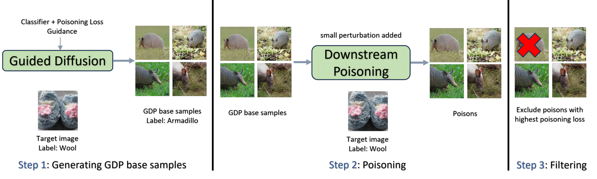

# Generating Potent Poisons and Backdoors from Scratch with Guided Diffusion

This code is the official PyTroch implementation of the [Generating Potent Poisons and Backdoors from Scratch with Guided Diffusion](https://arxiv.org/abs/2403.16365). Our implementation is based on [Industrial Scale Data Poisoning via Gradient Matching](https://github.com/JonasGeiping/poisoning-gradient-matching), [PyTorch pretrained Diffusion Models
](https://github.com/pesser/pytorch_diffusion) and [this awesome repo](https://github.com/JonasGeiping/data-poisoning).




## Dependencies

- PyTorch => 1.6.*
- torchvision > 0.5.*
- higher [best to directly clone https://github.com/facebookresearch/higher and use ```pip install .```]
- python-lmdb [only if datasets are supposed to be written to an LMDB]


## USAGE

The wrapper for the GDP can be found in `brew_poison.py`. To craft poisons on CIFAR-10 and ResNet18 with the default values, you can use the following command:

```shell
python brew_poison.py --diffusion_base_poisons --filter_max_matching --num_poisons 50
```


There are a bunch of optional arguments in the ```forest/options.py```. Here are some of them:

- ```--eps```, and ```--budget``` : Determine the power of backdoor attack.
- ```--net``` : which model to attack on.
- ```--num_poisons``` : Number of filtered poisons.
- ```--base_optim_guidance_3_wt``` : Guidance strength.
- ```--base_num_steps``` : Recurrent steps for base poisons.
- ```--base_poison_loss_w``` : Classifer guidance weight.

## Citation
Please cite our paper:

```
@misc{souri2024generating,
      title={Generating Potent Poisons and Backdoors from Scratch with Guided Diffusion}, 
      author={Hossein Souri and Arpit Bansal and Hamid Kazemi and Liam Fowl and Aniruddha Saha and Jonas Geiping and Andrew Gordon Wilson and Rama Chellappa and Tom Goldstein and Micah Goldblum},
      year={2024},
      eprint={2403.16365},
      archivePrefix={arXiv},
      primaryClass={cs.LG}
}
```
